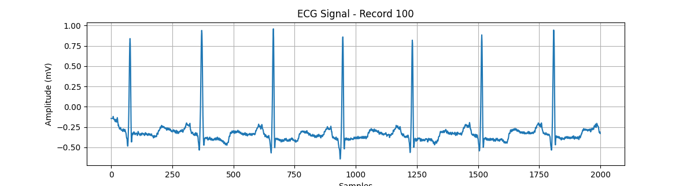
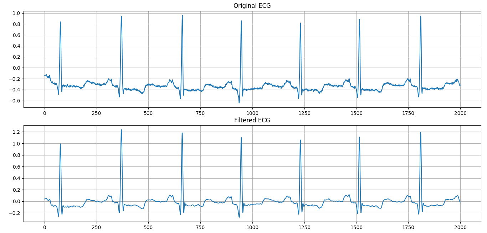
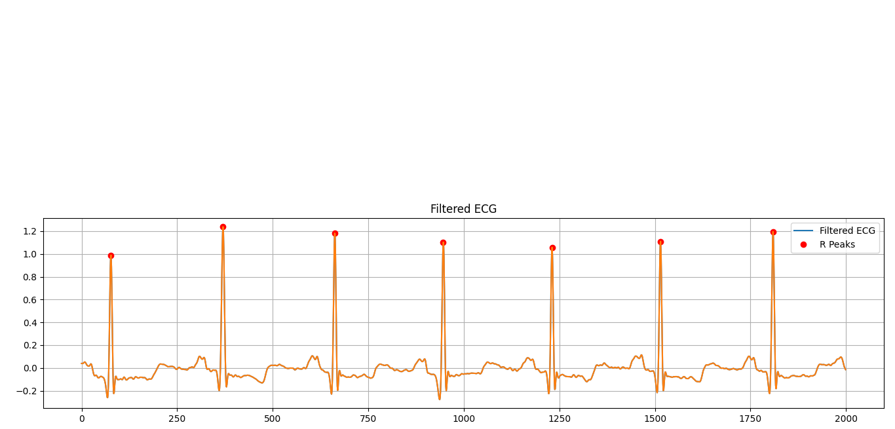
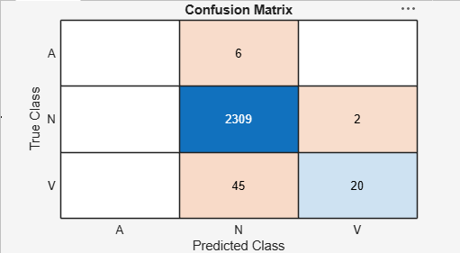

# ❤️ Automated ECG Arrhythmia Detection using Machine Learning

> Detecting cardiac arrhythmias from ECG signals using Python, MATLAB, signal processing, and a Support Vector Machine (SVM) classifier.

---

## 📌 Project Overview

Electrocardiograms (ECGs) are one of the most widely used diagnostic tools for detecting heart abnormalities. Manual interpretation of ECG signals can be time-consuming and prone to human error, especially when dealing with large amounts of patient data.

This project presents an automated ECG arrhythmia detection system that processes ECG recordings, extracts heartbeat features, and classifies heartbeats into different arrhythmia categories using Machine Learning.

The project combines **Python** for signal processing and feature extraction with **MATLAB** for machine learning model training and performance evaluation.

---

## 🎯 Objectives

- Read ECG recordings from the MIT-BIH Arrhythmia Database.
- Filter and preprocess ECG signals.
- Detect R-peaks automatically.
- Extract heartbeat features.
- Create a labeled heartbeat dataset.
- Train an SVM classifier.
- Classify heartbeats into different arrhythmia classes.
- Evaluate model performance using a confusion matrix and accuracy.

---

## 🫀 Arrhythmia Classes

The trained model classifies ECG beats into the following classes:

| Label | Description |
|-------|-------------|
| N | Normal Beat |
| A | Atrial Arrhythmia |
| V | Ventricular Arrhythmia |

---

# 🏗 Project Workflow

```
MIT-BIH ECG Database
          │
          ▼
Read ECG Signal
          │
          ▼
Signal Preprocessing
(Bandpass Filter + Notch Filter)
          │
          ▼
R-Peak Detection
          │
          ▼
Feature Extraction
(RR Interval, Heart Rate)
          │
          ▼
Dataset Creation
          │
          ▼
SVM Training (MATLAB)
          │
          ▼
Heartbeat Classification
          │
          ▼
Performance Evaluation
```

---

# 📂 Project Structure

```
ECG_Arrhythmia_Project
│
├── README.md
├── LICENSE
├── .gitignore
│
├── python
│   ├── main.py
│   ├── create_dataset.py
│   └── create_labeled_dataset.py
│
├── matlab
│   ├── main.m
│   ├── loadDataset.m
│   └── trainSVM.m
│
├── data
│   ├── heartbeat_dataset.csv
│   └── ecg_features_dataset.csv
│
├── screenshots
│   ├── ecg_signal.png
│   ├── ecg_filtering.png
│   ├── r_peak_detection.png
│   ├── filtered_ecg_r_peaks.png
│   └── confusion_matrix.png
│
└── report
    └── Project_Report.pdf
```

---

# 🛠 Technologies Used

### Programming Languages

- Python
- MATLAB

### Python Libraries

- WFDB
- NumPy
- Pandas
- SciPy
- Matplotlib
- Scikit-learn

### Dataset

- MIT-BIH Arrhythmia Database (PhysioNet)

---

# 📊 Results

### Dataset

- ECG Records Processed: **10**
- Total Heartbeats: **11,911**

### Machine Learning Model

- Algorithm: **Support Vector Machine (SVM)**
- Training Samples: **9,529**
- Testing Samples: **2,382**

### Model Accuracy

**97.6%**

---

# 📷 Project Outputs

### Original ECG Signal



---

### ECG Filtering



---

### R-Peak Detection



---

### Filtered ECG with Detected Peaks


---

### Confusion Matrix



---

# 📈 Confusion Matrix

The confusion matrix compares the model's predicted heartbeat class with the actual heartbeat label.

It helps evaluate:

- Correct classifications
- Misclassifications
- Overall model accuracy

The trained SVM achieved an overall accuracy of approximately **97.6%**.

---

# 🚀 Future Improvements

- Increase the number of ECG records used for training.
- Train Deep Learning models such as CNN or LSTM.
- Detect additional arrhythmia classes.
- Develop a real-time ECG monitoring system.
- Integrate with wearable ECG sensors.
- Deploy the model as a web application.

---

# 📚 References

- MIT-BIH Arrhythmia Database
- PhysioNet
- WFDB Toolbox Documentation
- MATLAB Documentation
- Scikit-learn Documentation

---

# 👩‍💻 Authors

**Krishnapriya S,
  Khadeeja Hannath V U,
  Diya ferose T T,
  Sana P M**

B.Tech Electronics and Biomedical Engineering

Model Engineering College, Kochi

GitHub: https://github.com/krishn228

---

⭐ If you found this project useful, consider giving it a star!


